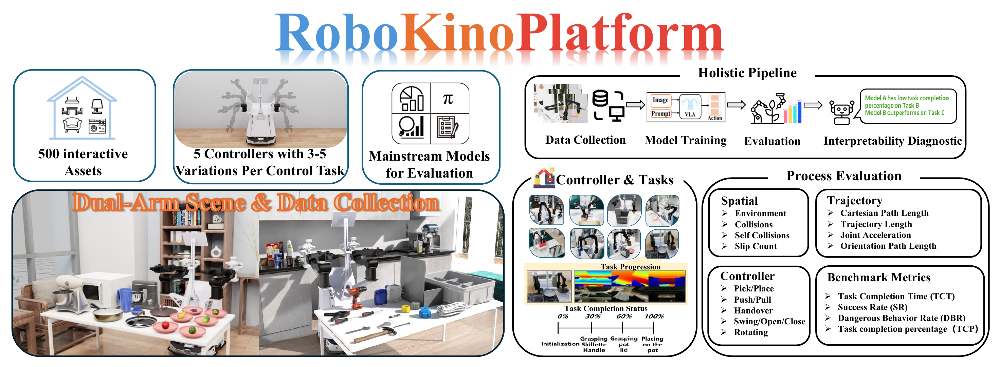

<div align="center">

# RoboKino

**Dual-arm manipulation · Expert data collection · Simulation-based evaluation**

[Quick Start](#quick-start) · [Tasks](#tasks-and-controllers) · [Data Collection](#data-collection) · [Evaluation](#policy-evaluation) · [中文说明](README_zh-CN.md)

</div>

<p align="center">
  <a href="docs/images/robokino-framework.pdf">
    
  </a>
</p>

*RoboKino platform overview, supplied by the project author. Click the figure for the vector PDF. The figure presents the broader project design; the release status below describes the code currently included here.*

## Overview

RoboKino is an Isaac Sim-based project for dual-arm manipulation, expert demonstration collection, and fine-grained evaluation. Its design organizes manipulation around five families of atomic skills: pick/place, open/close, handover, rotation, and pull/push, with domestic, desktop, and industrial scenarios.

This repository now includes a simulation implementation adapted from [FluxBisim](https://github.com/FluxVLA/FluxBisim), with task controllers, scene and robot configuration, HDF5 collection scripts, and a ROS-based policy evaluation interface. The imported configuration uses a mobile ALOHA-style base with two Piper arms. Code provenance and local additions are documented in [THIRD_PARTY.md](THIRD_PARTY.md).

## Release Status

| Component | Included in this repository |
| --- | --- |
| Five task families and scripted controllers | Source code and collection configurations |
| Isaac Sim environment | Robot, scene-object, camera, and task wrappers |
| Demonstration collection | Per-episode HDF5 writer with RGB observations, joint states, and actions |
| Policy evaluation | Five task presets, ROS observation/action bridge, success rate and completion-step statistics |
| RoboKino figures | Author-supplied platform overview in PNG and PDF |
| 3D simulation assets | Download separately; configuration expects `assets/` |
| Training and LeRobot conversion | External FluxVLA workflow; links below |
| TCT, DBR, TCP and richer process diagnostics | Part of the RoboKino design; full reporting is a roadmap item |

RoboKino-specific trajectory releases, the full asset collection shown in the overview, paper metadata, and measured benchmark results will be documented when they are released. The external assets and datasets linked below remain attributed to their original providers.

## Tasks and Controllers

| Skill | Example task | Collection script | Scene | Configuration |
| --- | --- | --- | --- | --- |
| Pick / place | Place fruit on a plate | [`fruit_pick_place_collect.py`](data_collect/pick_place_fruit/fruit_pick_place_collect.py) | `kitchen`, `apartment` | `{fruit}_pick_place_config.yaml` |
| Open / close | Place a nut and close the box | [`box_close_collect.py`](data_collect/close_box/box_close_collect.py) | `industry` | `box_close_config.yaml` |
| Handover | Transfer and store a book | [`book_handover_collect.py`](data_collect/handover_book/book_handover_collect.py) | `apartment`, `industry` | `book_handover_config.yaml` |
| Pull / push | Store an apple in a drawer | [`drawer_pull_push_collect.py`](data_collect/pull_push_drawer/drawer_pull_push_collect.py) | `apartment` | `drawer_pull_push_config.yaml` |
| Rotation | Screw a pitcher lid | [`pitcher_lid_screw_collect.py`](data_collect/screw_pitcher_lid/pitcher_lid_screw_collect.py) | `apartmentshort` | `pitcher_lid_screw_config.yaml` |

Fruit configurations are provided for `apple`, `banana`, `carrot`, `cucumber`, `mangosteen`, and `whiteradish`. Motion generation uses the Piper URDF and RMPflow configuration in [`controllers/motion/`](controllers/motion/).

## Quick Start

### 1. Set up the simulator

The imported code targets **Isaac Sim 4.5.0**. Use its bundled Python environment and an NVIDIA GPU compatible with that release. The commands below use Linux/bash. See NVIDIA's [Isaac Sim 4.5.0 download page](https://docs.isaacsim.omniverse.nvidia.com/4.5.0/installation/download.html).

```bash
git clone https://github.com/vigorlee/RoboKino.git
cd RoboKino

export ISAAC_SIM_PATH=/path/to/isaac-sim-4.5.0
"${ISAAC_SIM_PATH}/python.sh" -m pip install -r requirements.txt
alias benchmark_python="${ISAAC_SIM_PATH}/python.sh"
```

Newer Isaac Sim versions may require API changes. Isaac Sim and ROS are installed separately; `requirements.txt` supplies the additional Python dependencies.

### 2. Prepare simulation assets

For the imported task configurations, download the original [FluxBisimAssets](https://huggingface.co/datasets/limxdynamics/FluxBisimAssets) into `assets/`. Install the [Hugging Face CLI](https://huggingface.co/docs/huggingface_hub/guides/cli) in a separate download environment if `hf` is unavailable.

```bash
mkdir -p assets
hf download limxdynamics/FluxBisimAssets \
  --repo-type dataset \
  --local-dir assets
```

These are external simulation assets, licensed separately under **CC BY-NC 4.0** according to their dataset card. The Apache/MIT source licenses do not replace the asset license. The 3D assets are not bundled with this repository.

To use your own RoboKino assets, update [`envs/cfg/objects.yaml`](envs/cfg/objects.yaml) and [`envs/cfg/robots.yaml`](envs/cfg/robots.yaml). Preserve the expected robot articulation, joint, and camera prim names or update the corresponding Python wrappers. See [runtime and asset notes](docs/runtime.md).

### 3. Collect a first demonstration set

Run from the repository root. Set `max_demo` in the selected YAML file to control the number of successful demonstrations.

```bash
benchmark_python data_collect/pick_place_fruit/fruit_pick_place_collect.py \
  --env kitchen \
  --config banana_pick_place_config.yaml \
  --data_path data/robokino/pick_place_banana
```

The current collection entry points start a graphical simulator. They save successful episodes only; a difficult scene may require more attempts than the configured number of demonstrations.

## Data Collection

All five entry points accept `--env`, `--config`, and optional `--data_path`. Configuration names resolve relative to the collection script's directory.

```bash
# Place a nut and close the box
benchmark_python data_collect/close_box/box_close_collect.py \
  --env industry --config box_close_config.yaml

# Transfer and store a book
benchmark_python data_collect/handover_book/book_handover_collect.py \
  --env apartment --config book_handover_config.yaml

# Store an apple in a drawer
benchmark_python data_collect/pull_push_drawer/drawer_pull_push_collect.py \
  --env apartment --config drawer_pull_push_config.yaml

# Screw a pitcher lid
benchmark_python data_collect/screw_pitcher_lid/pitcher_lid_screw_collect.py \
  --env apartmentshort --config pitcher_lid_screw_config.yaml
```

Without `--data_path`, output goes to `data/<env>/<task>/episode_00000.hdf5`. Each HDF5 episode contains:

```text
observations/
├── images/
│   ├── left_cam
│   ├── right_cam
│   └── head_cam
└── qpos
action
```

Collection writes HDF5. For training with LeRobot Dataset v2.1, use FluxVLA's external [data conversion guide](https://github.com/FluxVLA/FluxVLA/blob/main/docs/data_convert.md). The original upstream training dataset is [FluxBisimData](https://huggingface.co/datasets/limxdynamics/FluxBisimData); it is maintained by LimX Dynamics.

**Collection reuses episode filenames when restarted in the same output directory. Choose a new `--data_path` for each run to preserve previous data.**

## Policy Evaluation

Evaluation requires ROS 1 Noetic, `roscore`, RViz, `rospy`, `cv_bridge`, `sensor_msgs`, `std_msgs`, and OpenCV accessible to the Isaac Sim Python process. Set up a compatible ROS environment before launching; see the [upstream installation instructions](https://github.com/FluxVLA/FluxBisim#%EF%B8%8F-installation). Binary `cv_bridge` builds must match the Python interpreter used by the simulator.

In the simulator terminal:

```bash
source /opt/ros/noetic/setup.bash
PYTHON_BIN="${ISAAC_SIM_PATH}/python.sh" \
  bash robokino_benchmark.sh pick_place_banana --num-episodes 100
```

The RoboKino launcher checks the task and required commands, changes to the repository root, then invokes the preserved upstream launcher. Use `bash robokino_benchmark.sh --help` to list tasks.

In a second terminal, run a compatible policy client. For FluxVLA, use its [evaluation instructions](https://github.com/FluxVLA/FluxBisim#model-evaluation) and select a configuration/checkpoint matching the simulator task. Training code and model checkpoints belong to that external project.

Supported presets: `close_box`, `handover_book`, `pick_place_banana`, `pull_push_drawer`, and `screw_pitcher_lid`. Additional evaluation flags are `--num-episodes`, `--chunk-size`, and `--save-images true`.

The current evaluator logs **success rate** and **mean/std completion steps** for successful episodes. No RoboKino leaderboard is published in this checkout. TCT, DBR, TCP, and detailed trajectory/coordination reporting require additional implementation and validation.

## Repository Layout

```text
RoboKino/
├── controllers/              # RMPflow motion generation and task controllers
├── data_collect/             # Five collection entry points, YAML configs, HDF5 utilities
├── envs/                     # Isaac Sim environment, objects, robots, scene configuration
├── tasks/                    # Task definitions, randomization, success checkers
├── rviz/                     # Preserved upstream ROS visualization configuration
├── docs/images/              # Author-supplied RoboKino platform figure
├── tools/check_repository.py # Checks that do not require Isaac Sim
├── evaluate.py               # Isaac Sim / ROS policy bridge
├── robokino_benchmark.sh     # RoboKino evaluation launcher
├── fluxbisim_benchmark.sh    # Preserved upstream launcher
├── requirements.txt
├── LICENSE                  # Original Apache 2.0 license for imported code
├── licenses/MIT-RoboKino.txt # MIT license for original RoboKino additions
└── THIRD_PARTY.md            # Pinned upstream source and import scope
```

## Development and Roadmap

Run the repository checks without starting the simulator:

```bash
python -m pip install 'PyYAML>=6,<7'
python tools/check_repository.py
```

These checks cover Python syntax, YAML parsing, preset/configuration consistency, local documentation links, and figure integrity. Full simulation still requires Isaac Sim, a GPU, and the external assets. See [CONTRIBUTING.md](CONTRIBUTING.md) for adding tasks.

- [x] Import five simulation tasks, atomic controllers, and HDF5 collection.
- [x] Add the RoboKino overview figure and reproducible usage documentation.
- [x] Provide the ROS policy-evaluation interface and a RoboKino launcher.
- [ ] Release RoboKino-specific assets, trajectories, and model configurations.
- [ ] Extend scene variation and long-horizon skill composition.
- [ ] Implement and validate TCT, DBR, TCP, and process diagnostics.
- [ ] Publish benchmark protocols, measured results, and paper citation metadata.

## Attribution and License

The simulation source was imported from [FluxVLA/FluxBisim](https://github.com/FluxVLA/FluxBisim/tree/621df43e08df3f27b5355e65e3f2c2918750bccb), commit `621df43e08df3f27b5355e65e3f2c2918750bccb`, under **Apache 2.0**. Its copyright notices and [LICENSE](LICENSE) are preserved. RoboKino-authored documentation and launcher/checking utilities use [MIT](licenses/MIT-RoboKino.txt); the project figure is supplied by the RoboKino author. See [NOTICE](NOTICE) and [THIRD_PARTY.md](THIRD_PARTY.md) for scope and changes.

Acknowledgements: FluxVLA / LimX Dynamics, AgileX Robotics for the Piper platform description, NVIDIA Isaac Sim, and the LeRobot community. External asset providers include YCB, Lightwheel SimReady, and X-Humanoid ArtVIP, as acknowledged by the upstream project.

Until formal paper metadata is available, cite the [RoboKino repository](https://github.com/vigorlee/RoboKino) with the commit used in your experiment, and also acknowledge FluxBisim when using its implementation.

Questions and reproducibility reports: [GitHub Issues](https://github.com/vigorlee/RoboKino/issues).
